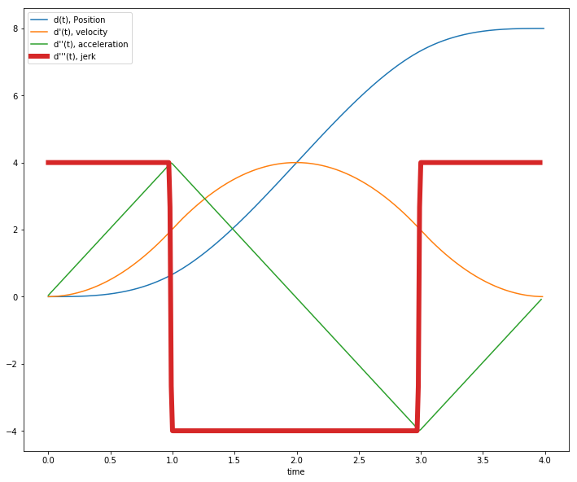
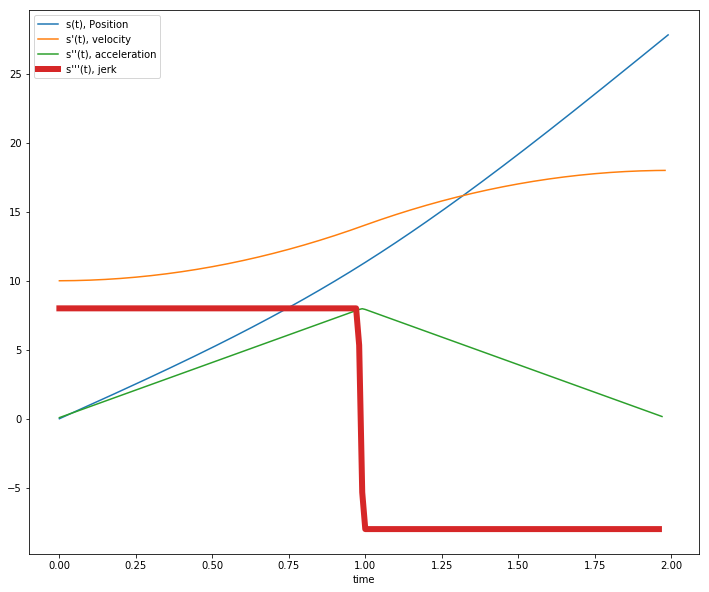
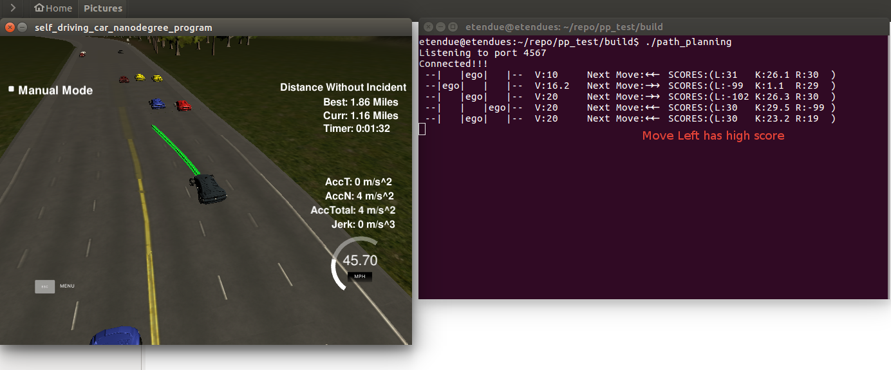
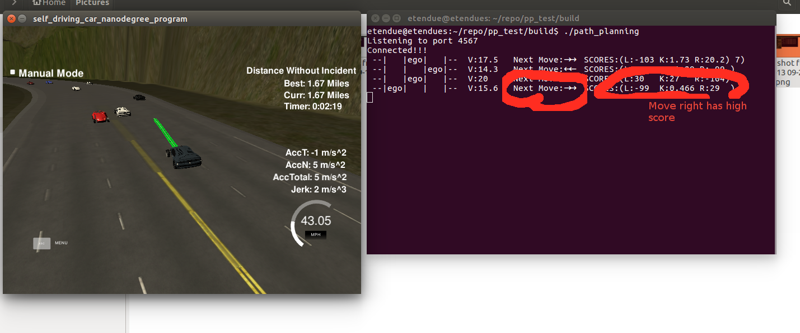
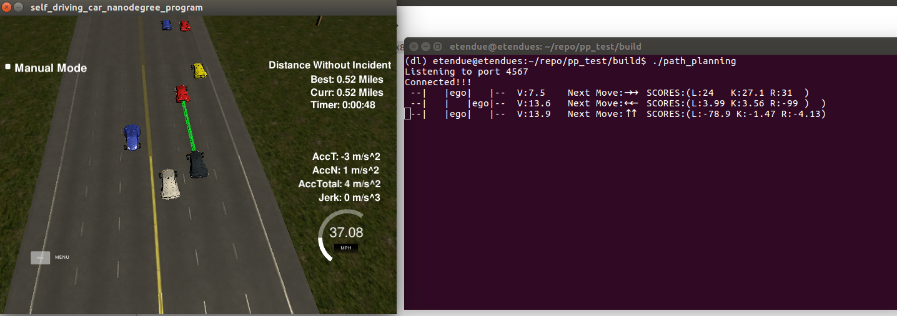
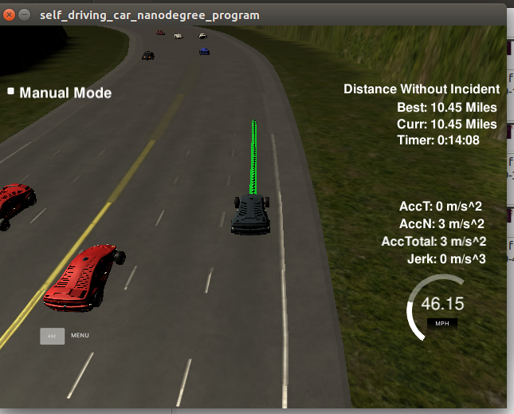
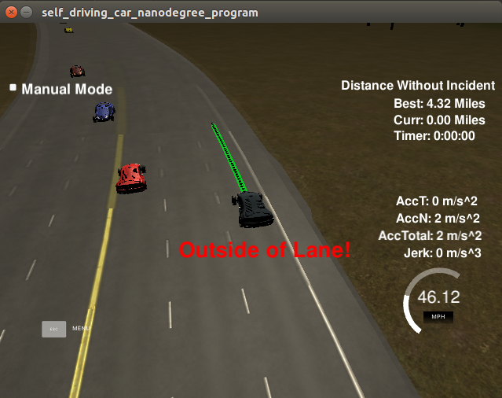

---

# Path planing


## [Rubric](https://review.udacity.com/#!/rubrics/1020/view) Points
## how to generate paths

### Behaviour Control
Car has three actions to choose:
* Keep on the lane
* Change to left lane
* Change to right lane

`Change lane` actions are transient and must be executed quickly, so cross lane 
movement is favored; `Keep lane` is rather continuous movement, so movement along 
the car direction is prioritised. This different is explained in latter session 
how to generate paths.

How to choose next action is based on the `score` value of each lane. Following 
 functions are called before to plan next action/move.
 ```c++
  //! following functions are to get a score based surround cars and ego driving information
  double getKeepLaneScore();
  double getChangeLeftScore();
  double getChangeRightScore();
 ```
 
The criteria for scores are collected on different aspects of ego car and its 
surroundings. Here are the list and scores for each category:

| Category      |  score range      | explanation  |
| :------------- |:-----------------:|:------------:|
| front car not exist, yes or no| +1       |  addtional 1 point |
| front car is far away >30m   |  +1 ~ +10      | the more far better score   |
| front is has safe distance 10~30m| -22 ~ +22     | the value depends if front car is slower or faster than ego car   | 
| action is keep lane| +2 | the keep lane behavior is by default favored|
| surrounding cars are near <10m| -99 | penalt when surrounding cars are near, only checked for lane change|
 
### Trajectory prediction/generation
to generate the path, we need consider mainly 2 goals: **reach the target**, 
**respect constraints**.

#### Reach the target goal
To reach the target goal with available dynamic motion properties such as available acceleration.
For 2 different actions(in fact 3, but change left and change right are same), different 
strategies are used.

For **keep lane action**, the main focus is how to reach the target speed and position. The main power
of car is used for acceleration or slow down to avoid collision; secondary important task is to
keep the car at the center of lane, if possible. The code is implemented in:
```c++
PathPlaner.h PathPlaner.cpp line:289 - 424
/*!
        \param dv:  delta velocity between new predicted and last value
        \param d_target:  position of d component new prediction wants to reach
        \param x_path: container to store the predicted x values
        \param y_path: container to store the predicted y values
        \return none
    */
  void generateKeepLanePath(double dv,double d_target,vector<double>& x_path,vector<double>& y_path);
```
For **change lane action**, the driving power is used to move across the lane and put remaining
fuel for speed control. Here the risks of other cars hit ego cars are taken care during evaluating the score of lane.

```c++
PathPlaner.h PathPlaner.cpp line:425 - 531
  void generateChangeLanePath(double dv,double d_target,vector<double>& x_path,vector<double>& y_path);
```

#### Respect the constraints 
Ego car is required to move smoothly and safe. That means no big jerk, acceleration as well as no over speed. Before
talking about the smooth, the safe part is took care by following tactics:
- avoid collision to front car. This is checked during path generation. The generated path shall never reach front car.
see code in function `generateKeepLane() line 324`. A distance with a car length is checked. This is guaranteed 
by algorithm unless front car drives backwards :(
- avoid collision with cars at left and right are purely guided by scores. So if collision happens,make
 the safe distance, speed distance bigger. Quite conservative approach.
 
##### Smooth path
Since jerk, acceleration and speed are third, second and first order derivatives of trajectory. We can not simply 
manipulate the value of X and Y coordinate or Frenet coordinate s and d. In lesson introduced Jerk 
Minimum Trajectory (JMT) with 5th order of polynomial can generate desired trajectory but has some 
 unknown parameters to cope with. For convenience the Frenet coodinate system is choosed for
  planning and convert back to XY for simulator.
  
There are 2 Dimensions to plan, `s direction` and `d direction`.
- `s direction`: the car can be at any allowed state during driving, i.e. target position can have any 
allowed speed, acceleration and jerk. s'(t), s"(t), s'''(t) can be any value. 
- `d direction`: the car has known end state with fixed position, speed,and acceleration. I.e.
 d'(t), d"(t), d'''(t) = 0, d(t) = lane center.
 
For `d direction`, we may use JMT to generate a path, since distance is fixed around 4m, and time is required
for <3s. However under condition of Jerk maximum==10m/s^3 and acceleration maximum ==10m/s^2, car can not reach
4 meter within 3s. Instead in this project I used 3rd polynomial spline which has constant jerk value 
between two way points.
 


* The red line is jerk `d'''(t)` value, its absolute value is fixed during trajectory.
* The green line is acceleration `d"(t)` value which is linear relation to jerk
* orange line is speed `d'(t)` a parabolic curve to time has start and end value 0
* the position blue line `d(t)` is third polynomial curve.

Since all know the time and position, the special points where jerk changes are picked and 
 use `tk::spline` to fit the curve. The generated path is guaranteed to fulfill the constraints.
 
For `s direction`, JMT is hard to choose parameter. Because it needs the target state and time to 
reach target. The target state can have all possible values for given constraints and time is also
hard to guess. Instead the cubic spline is also also with a small different configuration.
An example of `s direction` path is shown below (for speed up case):

 

The difference to `d direction` is:
* The red line is jerk `s'''(t)` value changes one time
* The green line is acceleration `s"(t)` value reaches to 0 but never below 0

For slow down case, the only change is first set jerk value to minus then to plus.

##### Trick to generate path
The whole plan is under Frenet coordinate, but later transformed to XY. Here are the steps:

1. get last prediction state(perfect control, so no sensor evaluation is done, in reality we can filters such as Kalman
  or Particle filter)
2. check target velocity and collision condition, if no collision, set `s'(t)` as big as possible
3. choose waypoints of s and d from the curve.
4. convert waypoints from sd to XY
5. use tk::spline to XY against time
6. interpolate the XYs for simulator


#### Results
Here are some screenshots of simulation.
1. change left


2. Change right


2. Slow down

### Thoughts and Observation

#### use previous predictions
For my algorithm, it is not necessary to use previous prediction, as the last ego car state
is stored and can be recovered even by sensor data. 

But for simplicity. I used the previous prediction to reduce the computation. In general the pathplaner generates 50 points at interval 1s. For change lane
it generate 200 points for 2.32 seconds.

####  Conversion from Frenet to XY has low precision
Though I smoothed the waypoints curve by interpolating s with X,Y using map data and tk::spline. 
(see function [getXY2() in main.cpp](./src/main.cpp)). At some position on the trip there are still inconsistent
 result.
 
#### Maximum speed can not be reached
This observation may related to simulator. In my path planer the target velocity and position are perfectly
computed and verified([see line 407-416 in PathPlaner.cpp](./src/PathPlaner.cpp)). The simulator will 
report overspeed at some positions. So I set the maximum speed in my code lower than maximum speed.

#### Front car suddenly brake or slow down.
Since we use the previous trajectory, the car can not react very quickly due to the latency. If front car suddenly slow
down too quickly, collision happens. Measurement would be disregarding previous trajectory or increase the safe distance.


#### Some spurious "outside the lane" warning.
This observation is frequently got when car drives on rightest lane. It occurs only at some position 
round the trip. I checked my code of d value during driving and could not find issue at my side. I am not
sure if it is some bug at simulator side.

So if ego car by chance does not travel on rightest lane, it can pass the requirement. Else bad luck, 
"Distance without incidence" will be reset by tihs "outside the lane".

Here is a good luck case.



Here is a bad luck case.


